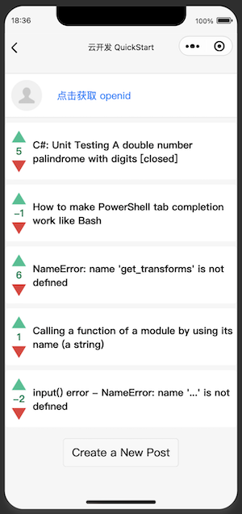
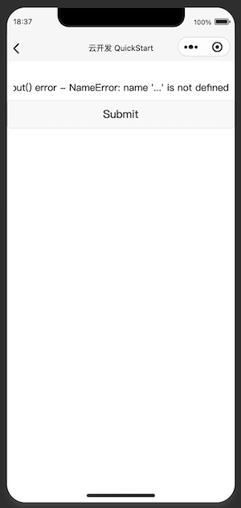

# WeChat-Mini-Program-Practice
My hands-on experience of the WeChat Mini Program framework

## 1. WeOverflow
A simple clone of stackoverflow (with wechat cloud functions)

### Setup
Download the WeChat developer tools <a href="https://developers.weixin.qq.com/miniprogram/en/dev/devtools/download.html">here</a> and import the repo folder.

 
